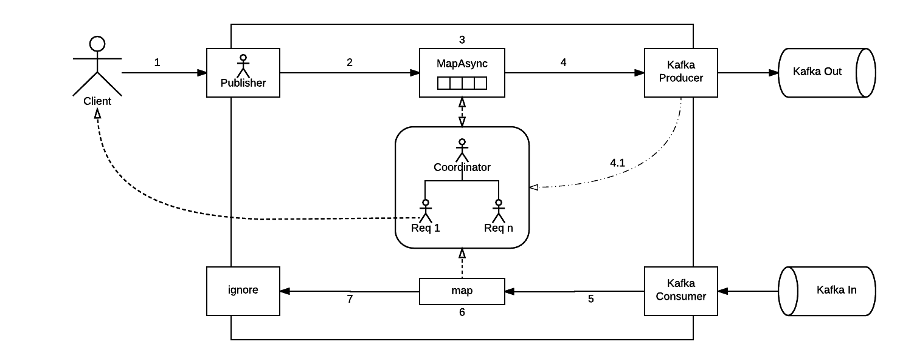

# Client Architecture

@@toc{ depth=3 }

## Overview

The Reactive System client offers an interface `ReactiveClient` that encapsulates the implementation and makes simple to the final user to interact with a Reactive Service.

The actual implementation of the client is based on Akka actors and streams.

## Stream Blueprint

The following diagram illustrates the Stream Blueprint for processing the incoming requests.

### Left-To-Right Flow
* Whenever a request comes in, the Reactive System client spawns an actor by using the _Ask pattern_ which sends a message to the Stream's Publisher and awaits for a response.
* The request will flow downstream to the _Actor-Per-Request_ Coordinator-Actor via a _mapAsync_ stage. It will then:
    * Hold a reference to the ask-pattern-actor that will be completed on the right-to-left flow.
    * Transforms the request in a `KafkaRequestEnvelope` to be sent downstream.
* Sends the request through a Kafka Producer stage.

### Right-To-Left Flow
* The flow starts from a Kafka Consumer stage.
* The response flow downstream to the _Actor-Per-Request_ Coordinator-Actor via a _map_ stage.
    * Is responsibility of the _Actor-Per-Request_ implementation to reply to the initial ask-pattern-actor.
* The sink just ignores what comes from the flow as the responsibility of completing the request has been leveraged to the _Actor-Per-Request_.

## Actor-Per-Request Pattern

In a nutshell, the client will use an actor-per-request pattern in order to deliver the request and await for its response.

The actor-per-request approach is implemented using Akka actors and its hierarchy consists of a parent Coordinator-Actor which creates and supervise one or many Request-Actor's.

### Coordinator Actor

Apart from supervising its children, the coordinator actor have two differentiated set of responsibilities:

When receiving **requests**: 
- Accepts the incoming requests.
- Generates a unique `correlationId` for each request.
- Spawn a child actor that will be in charge of a particular request.
- Tranforms the incoming request into a `KafkaRequestEnvelope` ready to be sent to Kafka and sends it downstream.

When receiving **responses**:
- Accepts the responses.
- Based on the `correlationId` of the response, it looks for a child Request-Actor awaiting for the response and forwards the response to it.

### Request Actor

The main responsibility of a Request-Actor is to complete or time-out the request-cycle. 

When created, it's passed the source _ask-pattern-actor_ reference to complete the cycle upon response reception and schedules a timeout in case the response is not received in a timely manner. 
