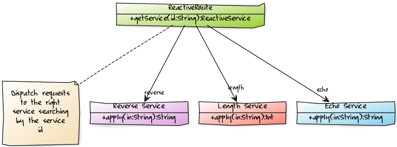

# Reactive System Server

The server is where you define the services which will be exposed by your application and that can be
consumed using asynchronous message exchange.
One of the strengths of Reactive System is that streaming data is at its heart (The server is build using Akka Stream) meaning that both requests and responses
can be streamed through the server achieving constant memory usage even for very large requests or responses. Streaming
responses will be backpressured against the kafka queue utilised by the server.

## Define Service using Routing DSL 

A Reactive System Route is in essence a map of services exposed by the server indexed against a service id.

Here is an example how you can create a route:

@@snip [SimpleRSServer.scala](../../../../examples/server/src/main/scala/org/patricknoir/kafka/examples/server/SimpleRSServer.scala) { #route-dsl-example }

The above code snipped generate a route that declare 3 services:

## Reactive Services

In order to create a service using a high level API the `request` object should be used. 
A service should be a simple function that given an `input` of type `In` should return an `output` of type `Out`.
If you want this code to be executed asynchronously then the `request.aSync(serviceId: String)(f: In => Out)` should be used,
otherwise we offer asynchronous execution by using `request.sync(serviceId: String)(f: In => Out)`.
A last option is if your function is already returning a future having a signature like the following: `f: In => Future[Out]`, 
in that case you should be using the `request.apply(serviceId: String)(f: In => Future[Out])`.

### Examples

Here is an example how to execute a function asynchronously:

@@snip [SimpleRSServer.scala](../../../../examples/server/src/main/scala/org/patricknoir/kafka/examples/server/SimpleRSServer.scala) { #route-example-make-async }

In this case we will force the `incrementCounter` function to run synchronously to avoid raise conditions:

@@snip [SimpleRSServer.scala](../../../../examples/server/src/main/scala/org/patricknoir/kafka/examples/server/SimpleRSServer.scala) { #route-example-make-sync }

In this last case the `getCounter` function is already returning a `Future[Int]` so we will use `request.apply`:

@@snip [SimpleRSServer.scala](../../../../examples/server/src/main/scala/org/patricknoir/kafka/examples/server/SimpleRSServer.scala) { #route-example-wrap-async }

## Running the server

Once all the services to expose have been defined in the `route: ReactiveRoute` is time to create an instance of `ReactiveSystem` and run it.

The simplest way to create and run a `ReactiveSystem` is the following:

@@snip [SimpleRSServer.scala](../../../../examples/server/src/main/scala/org/patricknoir/kafka/examples/server/SimpleRSServer.scala) { #run-reactive-system }